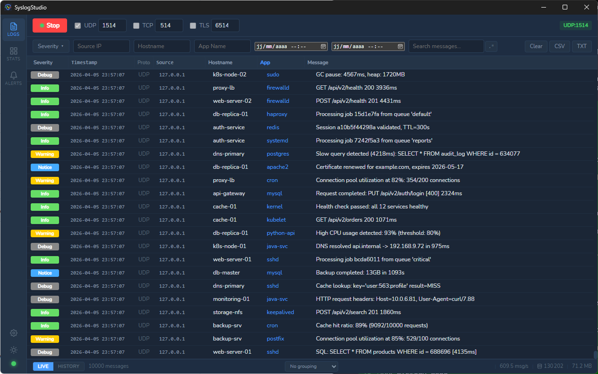
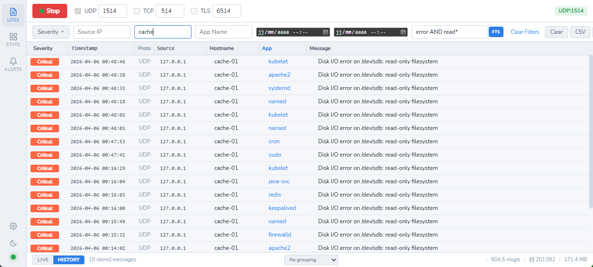
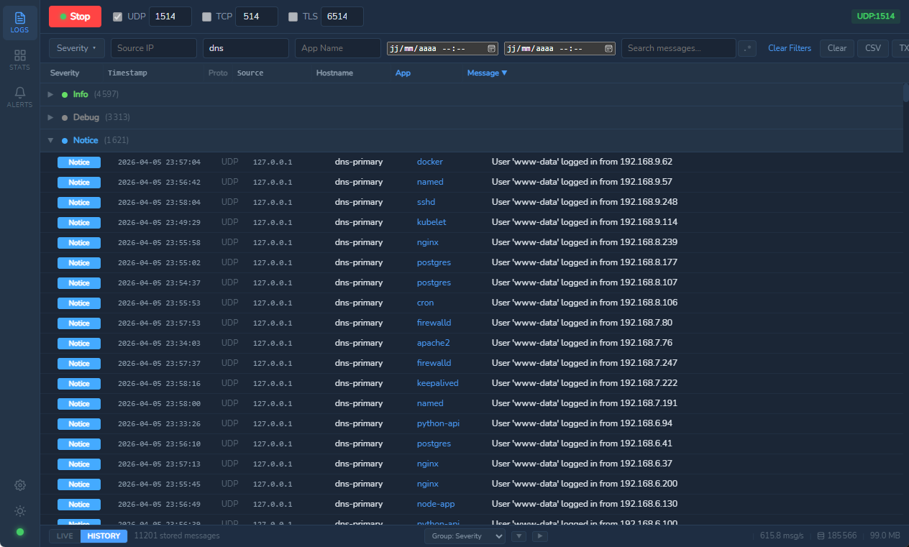
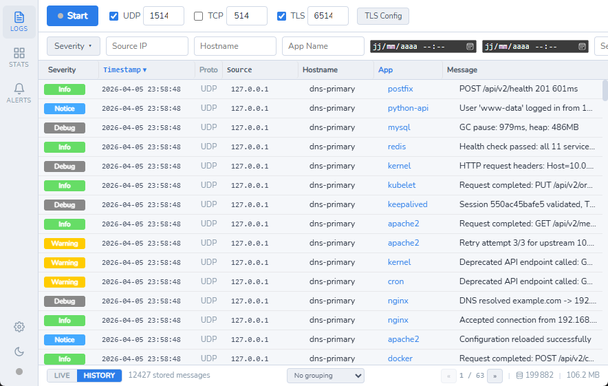
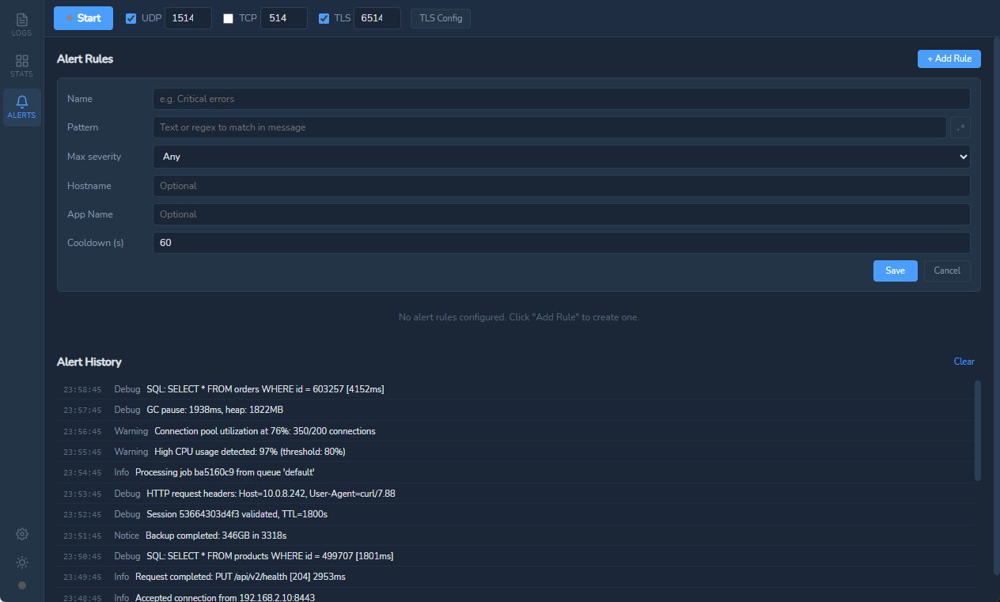
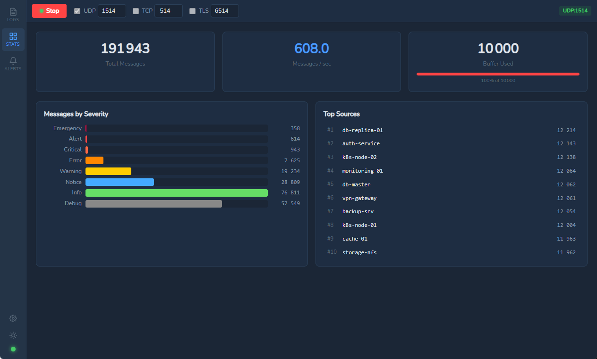
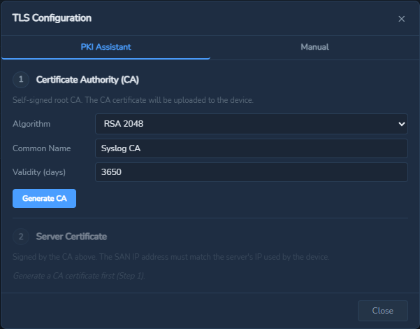
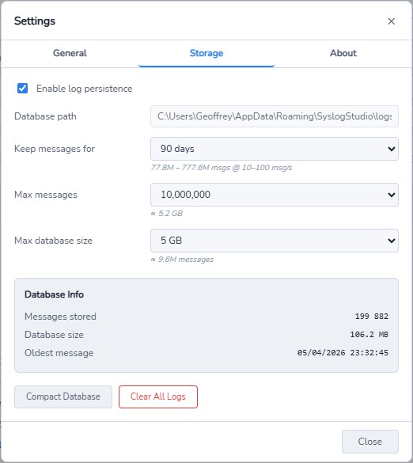
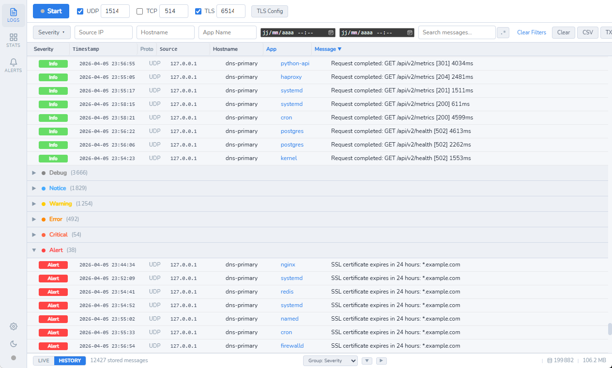

# SyslogStudio

<p align="center">
  
</p>

A lightweight, cross-platform desktop application for receiving and analyzing syslog messages in real time. Built with [Wails](https://wails.io/) (Go + Svelte).

## Screenshots

### Live Log Viewer
> Real-time message reception with severity badges, sortable columns, and auto-scroll.

<!-- Replace with actual screenshot: capture the main window with logs flowing in -->
<p align="center">
  
</p>

### Filtering & Regex Search
> Filter by severity, hostname, app, source IP, date range, and regex patterns.

<!-- Replace with actual screenshot: show the filter bar with active filters and filtered results -->
<p align="center">
  
</p>

### Group By
> Organize messages by severity, hostname, app, or source IP with expandable groups and color-coded headers.

<!-- Replace with actual screenshot: show grouped view with some groups expanded -->
<p align="center">
  
</p>

### History Mode
> Browse stored logs from the SQLite database with pagination, even after restarting the app.

<!-- Replace with actual screenshot: show history mode with pagination controls visible -->
<p align="center">
  
</p>

### Alert System
> Configure alert rules with pattern matching, severity thresholds, and cooldown. Receive system notifications when rules trigger.

<!-- Replace with actual screenshot: show the alerts view with rules and alert history -->
<p align="center">
  
</p>

### Statistics Dashboard
> Monitor message rates, severity distribution, top sources, and buffer usage at a glance.

<!-- Replace with actual screenshot: show the dashboard with charts populated -->
<p align="center">
  
</p>

### TLS / PKI Assistant
> Generate CA and server certificates directly from the UI. No command-line tools required.

<!-- Replace with actual screenshot: show the TLS config modal with PKI assistant steps -->
<p align="center">
  
</p>

### Settings
> Configure theme, language, storage retention, and database management.

<!-- Replace with actual screenshot: show the settings modal on the Storage tab -->
<p align="center">
  
</p>

### Light Theme
> Full light theme support with a single click.

<!-- Replace with actual screenshot: show the app in light theme with logs -->
<p align="center">
  
</p>

## Features

- **Multi-protocol syslog server** — UDP, TCP, and TLS (RFC 5424 & RFC 3164)
- **Real-time log viewer** — virtualized list with auto-scroll, sortable columns, and group-by (severity, hostname, app, source IP)
- **Advanced filtering** — severity, facility, hostname, app name, source IP, date range, and 3 search modes (see below)
- **Log persistence** — SQLite database with configurable retention (by age, count, or size). Browse historical logs with pagination even after restart
- **Alert system** — configurable rules (pattern, severity threshold, hostname/app filter, cooldown) with system notifications
- **TLS / PKI assistant** — generate CA and server certificates from the UI, mutual TLS support, certificate export
- **Statistics dashboard** — message rates, severity distribution, top sources, buffer usage
- **Log export** — CSV and plain text formats
- **Settings panel** — theme, language, storage retention policy, database management (compact, clear), size estimations
- **Light & dark themes** — persisted across sessions
- **8 languages** — English, French, German, Spanish, Portuguese, Italian, Japanese, Chinese
- **Full persistence** — server config, alert rules, and logs saved across restarts
- **Auto-update check** — notifies when a new version is available on GitHub
- **Memory-efficient** — in-memory ring buffer for live view, SQLite for history, bounded worker pool

### Search Modes

The search bar supports 3 modes, toggled by clicking the mode button:

| Mode | Button | Speed | Syntax | Example |
|------|--------|-------|--------|---------|
| **Text** | `Aa` | Instant | Simple substring match | `connection refused` |
| **FTS** | `FTS` | Instant | SQLite FTS5 full-text search | `error OR fail OR timeout` |
| **Regex** | `.*` | Slower | Go regular expressions | `(error\|fail)\s+.*timeout` |

**FTS syntax reference:**
- `error` — single word
- `error fail` — both words (AND)
- `error OR fail` — either word
- `error NOT debug` — exclude word
- `"connection refused"` — exact phrase
- `err*` — prefix wildcard
- `NEAR(error timeout, 5)` — words within 5 tokens

## Quick Start

### Prerequisites

- [Go](https://go.dev/dl/) 1.23+
- [Node.js](https://nodejs.org/) 18+
- [Wails CLI](https://wails.io/docs/gettingstarted/installation) v2

```bash
go install github.com/wailsapp/wails/v2/cmd/wails@latest
```

### Development

```bash
# Install frontend dependencies
cd frontend && npm install && cd ..

# Run in development mode (hot reload)
wails dev
```

The app opens in a native window. A dev server is also available at `http://localhost:34115` for browser-based development with access to Go methods.

### Build

```bash
wails build
```

Produces `build/bin/SyslogStudio.exe` (Windows) or the corresponding binary for your platform.

To set the version for auto-update:

```bash
wails build -ldflags "-X main.AppVersion=v1.0.0"
```

## Usage

1. **Configure protocols** — enable UDP, TCP, and/or TLS with desired port numbers
2. **TLS setup** (optional) — click "TLS Config" to generate a CA + server certificate, or load your own
3. **Start the server** — click Start; active listeners appear as badges (e.g., `UDP:514`)
4. **View logs** — messages appear in real time (Live mode); switch to History mode to browse stored logs with pagination
5. **Sort & group** — click column headers to sort (asc/desc); use the group-by dropdown to organize by severity, hostname, app, or source IP
6. **Filter** — use the filter bar to narrow by severity, hostname, source IP, date range, or regex
7. **Alerts** — configure alert rules to get notified when specific patterns or severities are detected
8. **Settings** — configure retention policy (days, max messages, max DB size), theme, language
9. **Export** — export filtered logs as CSV or TXT

### Testing with the Generator

A Python test generator is included (no dependencies, Python 3.7+):

```bash
# Send 10 messages/second with realistic content
python tools/syslog_generator.py --rate 10

# Simulate a full incident timeline
python tools/syslog_generator.py --mode scenario

# Test alert rules with specific severity/pattern messages
python tools/syslog_generator.py --mode alert-test

# Stress test (30 seconds, max throughput)
python tools/syslog_generator.py --mode stress
```

See [tools/README.md](tools/README.md) for all options (UDP/TCP/TLS, RFC 5424/3164, severity profiles, burst mode).

### Default Ports

| Protocol | Port |
|----------|------|
| UDP      | 514  |
| TCP      | 514  |
| TLS      | 6514 |

> Ports below 1024 may require elevated privileges depending on your OS.

## Storage

Messages are persisted in a local SQLite database with configurable retention:

| Setting | Options | Default |
|---------|---------|---------|
| Retention | 1, 7, 30, 90 days, unlimited | 7 days |
| Max messages | 10K, 100K, 1M, 10M, unlimited | 1M |
| Max DB size | 100 MB, 500 MB, 1 GB, 5 GB, unlimited | 500 MB |

Approximate storage: **~560 bytes per message** (1M messages ~ 530 MB).

## Documentation

- [User Guide](docs/USER_GUIDE.md) — complete usage documentation
- [TLS Setup Guide](docs/TLS_SETUP.md) — TLS configuration, PKI assistant, mutual TLS
- [Architecture](CLAUDE.md) — detailed technical architecture
- [Test Generator](tools/README.md) — syslog message generator for testing

## Contributing

See [CONTRIBUTING.md](CONTRIBUTING.md) for development setup, workflow, and code style guidelines.

## License

[MIT](LICENSE)
