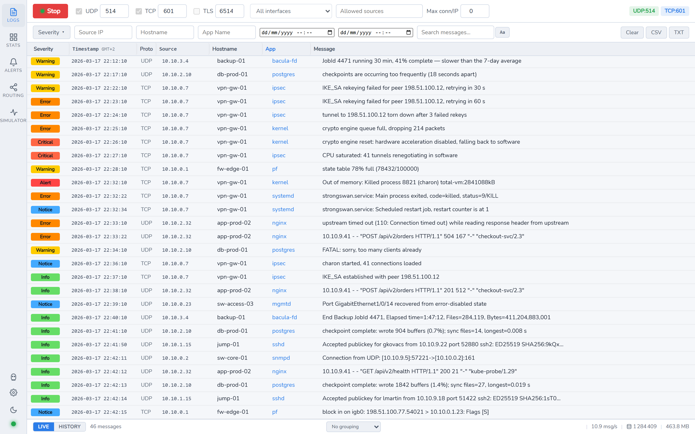
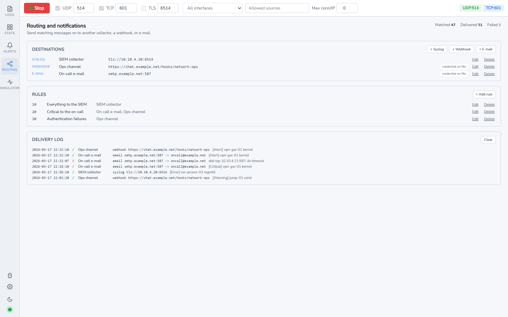
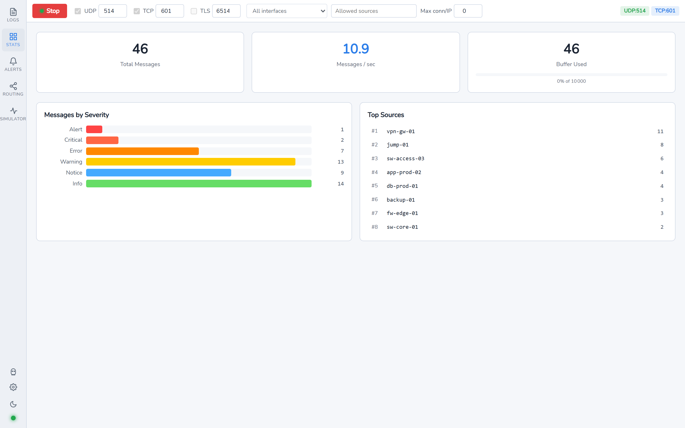
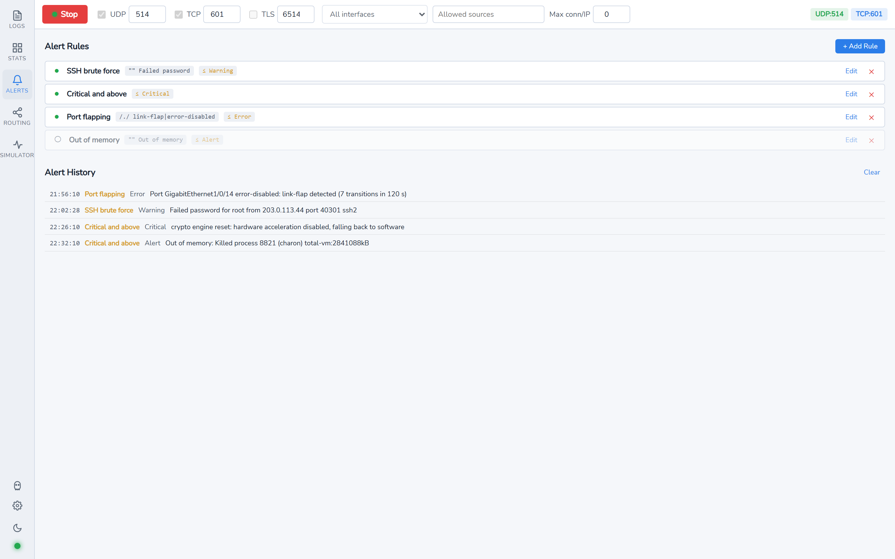
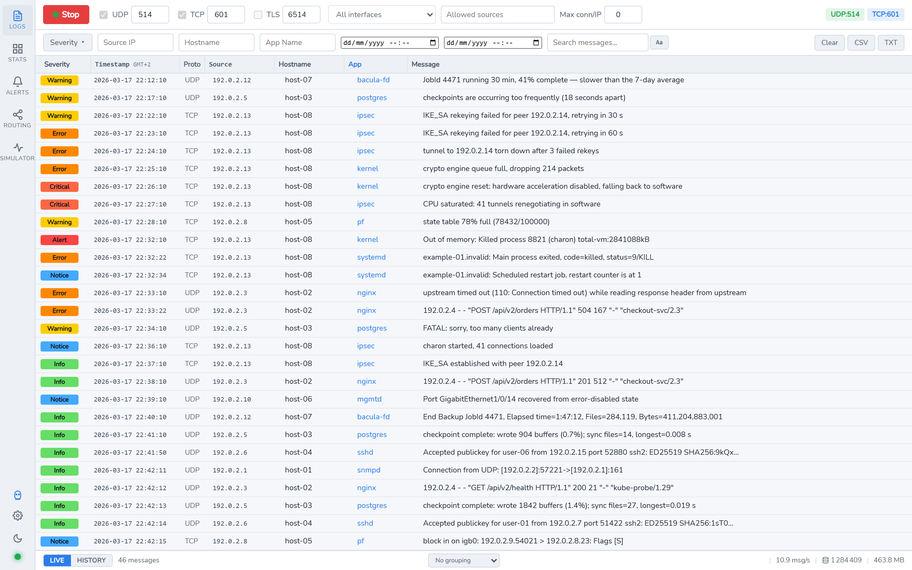
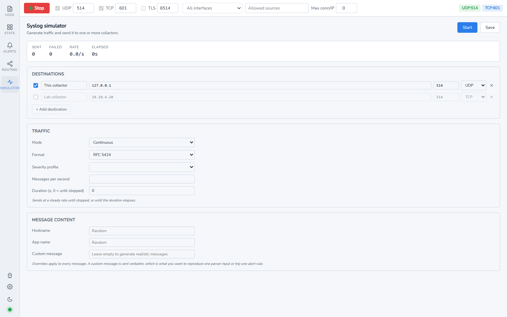

# SyslogStudio

<p align="center">
  
</p>

<p align="center">
  A syslog server, log viewer and alert router in one native binary.<br />
  Built with <a href="https://wails.io/">Wails</a> — Go and Svelte.
</p>

<p align="center">
  <a href="http://geoffrey-lecoq.fr/SyslogStudio/"><b>Website</b></a> ·
  <a href="http://geoffrey-lecoq.fr/SyslogStudio/demo.html"><b>Try it in your browser</b></a> ·
  <a href="http://geoffrey-lecoq.fr/SyslogStudio/download.html"><b>Download</b></a> ·
  <a href="http://geoffrey-lecoq.fr/SyslogStudio/documentation.html"><b>Documentation</b></a>
</p>

<p align="center">
  <a href="https://github.com/Wasabules/SyslogStudio/actions/workflows/ci.yml"></a>
  <a href="https://github.com/Wasabules/SyslogStudio/releases/latest"></a>
  <a href="https://github.com/Wasabules/SyslogStudio/releases"></a>
  <a href="https://github.com/Wasabules/SyslogStudio/blob/main/LICENSE"></a>
  
  
  
</p>

Point your switches, firewalls and servers at it and read what they say. Receive over
UDP, TCP or TLS, search months of history in a local database, raise alerts on the lines
that matter, and relay those lines on to another collector, a webhook or your inbox.
No agent, no account, no service to stand up.

> **Try it without installing anything.** The
> [browser demo](http://geoffrey-lecoq.fr/SyslogStudio/demo.html) is the real application
> running on sample data, with the Go backend replaced by fixtures. Every screenshot below
> comes from that same bundle, so none of them can show an interface the product does not
> actually produce.

---

## Screenshots

### Live log viewer

Messages as they arrive, with severity badges, sortable columns, filtering and group-by.

<picture>
  <source media="(prefers-color-scheme: dark)" srcset="docs/assets/img/live-dark.png" />
  
</picture>

### Routing and notifications

Rules decide which messages are interesting; destinations decide where they go — another
syslog collector, a webhook, or e-mail.

<picture>
  <source media="(prefers-color-scheme: dark)" srcset="docs/assets/img/routing-dark.png" />
  
</picture>

### Statistics

<picture>
  <source media="(prefers-color-scheme: dark)" srcset="docs/assets/img/dashboard-dark.png" />
  
</picture>

### Alerts

<picture>
  <source media="(prefers-color-scheme: dark)" srcset="docs/assets/img/alerts-dark.png" />
  
</picture>

### Anonymous mode

Hostnames, addresses and user names replaced by stable stand-ins, so a screenshot can go
in a ticket without going through a redaction tool first.

<picture>
  <source media="(prefers-color-scheme: dark)" srcset="docs/assets/img/anonymous-dark.png" />
  
</picture>

### Built-in traffic generator

<picture>
  <source media="(prefers-color-scheme: dark)" srcset="docs/assets/img/simulator-dark.png" />
  
</picture>

---

## Features

### Receiving

- **UDP, TCP and TLS** listeners, any port, bound to one interface or all of them
- **RFC 5424 with an RFC 3164 fallback**, on every transport — the switch that has not been
  updated since 2009 still parses
- **Mutual TLS** where senders must prove who they are
- **Allowed sources** by IP literal or CIDR (hygiene, not authentication — see the note below)
- **Per-IP connection cap** so one host cannot occupy every slot

### Reading

- **Live view** — an in-memory ring buffer of the last 10 000 messages, updating as they arrive
- **History** — server-side paginated queries over the database, as far back as your retention
- **Three search modes** — substring, SQLite FTS5 full-text, and Go regular expressions
- **Filter, sort and group** by severity, facility, host, application, source IP or time range
- **Explicit timezones** — follow the machine, pin to UTC, or name a zone; the column header
  says which one it is showing
- **Export** as CSV or plain text

### Keeping

- **SQLite persistence** with retention by age, count and size, cleaned in the background
- **At-rest encryption** — AES-256-GCM with Argon2id key derivation, the password held in
  memory only
- **Brute-force protection** that survives a restart, so a stolen laptop cannot be
  brute-forced by relaunching the application

### Noticing

- **Alert rules** on a substring or regular expression, a severity floor, a host or an
  application, with a cooldown so one flapping port is not four hundred notifications
- **Desktop notifications** and an alert history

### Forwarding

- **Rule-based routing** of *every* received message, not only the ones that trip an alert —
  which is what makes relaying a whole stream possible
- **Three destination kinds** — syslog (UDP/TCP/TLS, keeping the origin hostname), webhook
  (JSON envelope or your own template), and e-mail (STARTTLS, implicit TLS or none;
  authenticated or anonymous)
- **Mutual TLS** for syslog and e-mail destinations, each with its own trust anchor
- **Write-only credentials bound to their destination** — moving a webhook to another host
  drops the stored token rather than following it there
- **Loop detection** — a destination aimed at this application's own listener is refused, and
  a message already relayed is not relayed again
- **Rate breaker** — a destination flooded with repeating content is cut off, disabled and
  reported, rather than quietly filling a disk

### The rest

- **Built-in traffic generator** to prove the chain works before a device is pointed at it
- **Anonymous mode** masking hosts, addresses, MACs, e-mails and user names with stable
  stand-ins from the documentation ranges (RFC 5737, RFC 3849)
- **TLS/PKI assistant** — generate a CA and server certificates from the interface
- **Light and dark themes**, persisted
- **Eight languages** — English, French, German, Spanish, Portuguese, Italian, Japanese, Chinese
- **Signed releases** with SLSA build provenance and an in-application updater that verifies
  it before replacing anything

### Search syntax

| Mode | Button | Syntax | Example |
|------|--------|--------|---------|
| Text | `Aa` | substring | `connection refused` |
| FTS | `FTS` | SQLite FTS5 | `error OR fail OR timeout` |
| Regex | `.*` | Go regular expressions | `(error\|fail)\s+.*timeout` |

FTS accepts `error fail` (both), `error OR fail`, `error NOT debug`,
`"connection refused"` (phrase), `err*` (prefix) and `NEAR(error timeout, 5)`.

---

## Install

Download a build from the [releases page](https://github.com/Wasabules/SyslogStudio/releases/latest)
or the [download page](http://geoffrey-lecoq.fr/SyslogStudio/download.html). One executable,
no runtime to install.

| Platform | Files |
|---|---|
| Windows | NSIS installer, or portable `.zip` |
| macOS | universal `.dmg` or `.zip` (Apple Silicon and Intel) |
| Linux | `.deb`, or portable `.tar.gz` — needs GTK 3 and WebKit2GTK |

Verify what you downloaded:

```bash
gh attestation verify SyslogStudio-windows-amd64.zip --repo Wasabules/SyslogStudio
```

### Default ports

| Protocol | Default | Standard |
|----------|---------|----------|
| UDP | 1514 | 514 |
| TCP | 1514 | 514 or 601 |
| TLS | 6514 | 6514 |

The defaults are deliberately above 1024 so the first run binds without elevation on Linux
and macOS. To use 514 there, either run with privilege or grant the binary the one
capability it needs:

```bash
sudo setcap 'cap_net_bind_service=+ep' /usr/bin/syslogstudio
```

---

## Usage

1. **Choose the transports** in the bar across the top, set their ports, and press **Start**
2. **Point a device at it** — `logger -n <host> -P 1514 -d "hello"` is the quickest test
3. **Read** — Live for what is arriving, History for what is stored; filter, sort, group,
   and click a row for every parsed field and the raw frame
4. **Alerts** — write rules for the lines you must not miss, with a cooldown
5. **Routing** — add a destination, then a rule that feeds it
6. **Settings** — retention, encryption, timezone, theme, language

The [documentation](http://geoffrey-lecoq.fr/SyslogStudio/documentation.html) walks through
each of these, and everything except receiving can be tried in the
[demo](http://geoffrey-lecoq.fr/SyslogStudio/demo.html).

> **On UDP and trust.** A UDP source address is trivially forged. The allowed-sources list
> keeps a misconfigured host out of your database; it is not authentication. Where senders
> must genuinely be authenticated, use TLS with client certificates.

### Where things are kept

| Platform | Directory |
|---|---|
| Windows | `%APPDATA%\SyslogStudio\` |
| macOS | `~/Library/Application Support/SyslogStudio/` |
| Linux | `~/.config/SyslogStudio/` |

`config.json` holds settings, rules and destinations; `logs.db` the messages;
`sinksecrets.json` the destination credentials, encrypted when at-rest encryption is on.
No credential is ever written to `config.json`.

### Storage and encryption

| Setting | Options | Default |
|---------|---------|---------|
| Retention | 1, 7, 30, 90 days, unlimited | 7 days |
| Max messages | 10K, 100K, 1M, 10M, unlimited | 1M |
| Max size | 100 MB, 500 MB, 1 GB, 5 GB, unlimited | 500 MB |

Roughly 560 bytes per message, so a million messages is about 530 MB.

At-rest encryption uses AES-256-GCM with Argon2id (64 MB, 3 iterations, 4 threads). The
password exists only in memory while the application runs.

> **If you forget it, the database is gone.** There is no recovery mechanism, by design.

---

## Building it

### Prerequisites

- [Go](https://go.dev/dl/) 1.26+
- [Node.js](https://nodejs.org/) 18+
- [Wails CLI](https://wails.io/docs/gettingstarted/installation) v2

```bash
go install github.com/wailsapp/wails/v2/cmd/wails@latest
cd frontend && npm install && cd ..
```

### Development

```bash
wails dev
```

The application opens in a native window. A dev server is also available at
`http://localhost:34115`, which serves the same interface in a browser with the Go methods
bridged — handy for anything that is easier to inspect with devtools.

### Build

```bash
wails build
wails build -ldflags "-X main.AppVersion=v1.4.0"   # with a version, for the updater
```

### Tests

```bash
go test -race ./...
cd frontend && npx svelte-check --tsconfig ./tsconfig.json --fail-on-warnings
```

### The site and the demo

The project site lives in `docs/` and is published by GitHub Pages. The demo and the
screenshots are built from the real application with fixtures instead of a backend, which
is what stops the site showing something the product does not do.

```bash
node tools/demo.mjs          # build docs/demo/
node tools/screenshots.mjs   # photograph the application into docs/assets/img/
node tools/webp.mjs          # derive the responsive images the site serves
node tools/serve-site.mjs    # read docs/ the way Pages serves it
node tools/check-links.mjs   # what the Pages workflow checks before deploying
```

### Generating traffic

The application has a generator built in, on the Simulator tab. There is also a standalone
Python one with no dependencies:

```bash
python tools/syslog_generator.py --rate 10
python tools/syslog_generator.py --mode scenario
python tools/syslog_generator.py --mode stress
```

See [tools/README.md](tools/README.md) for every option.

---

## Documentation

- [Website](http://geoffrey-lecoq.fr/SyslogStudio/) and
  [browser demo](http://geoffrey-lecoq.fr/SyslogStudio/demo.html)
- [Usage documentation](http://geoffrey-lecoq.fr/SyslogStudio/documentation.html)
- [User guide](docs/USER_GUIDE.md) and [TLS setup](docs/TLS_SETUP.md)
- [Architecture](CLAUDE.md) — how the code is organised and why
- [Changelog](CHANGELOG.md)

## Contributing

See [CONTRIBUTING.md](CONTRIBUTING.md). Security reports go through
[SECURITY.md](SECURITY.md) rather than the issue tracker.

## Licence

[MIT](LICENSE)
